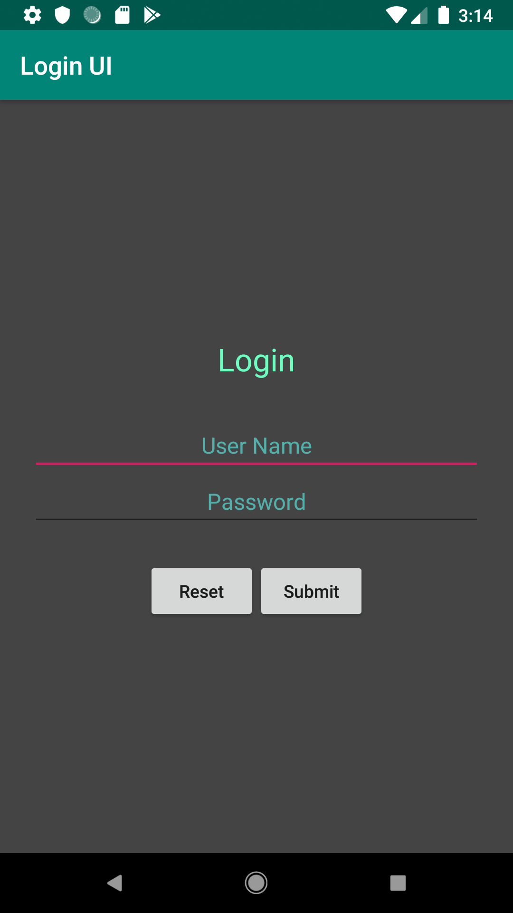
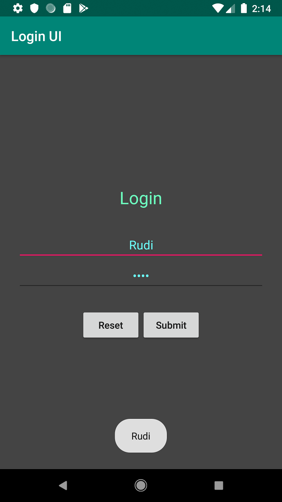

# Login UI Android

Simple UI Login Android Form with Kotlin

This Form can be used to check the username input
 
Also can be check the password
 
Reset button is to clear the username and password

  

    
  

  

    
  

Reference:

htt ps ://ww w.tutorial kart.c om/kotlin-android /login-form-example-in- kotlin-android/
